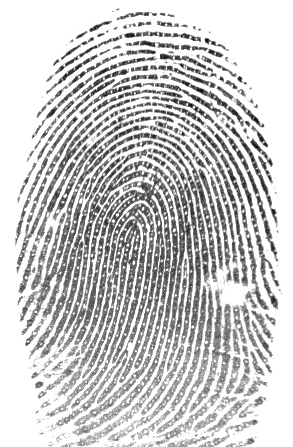
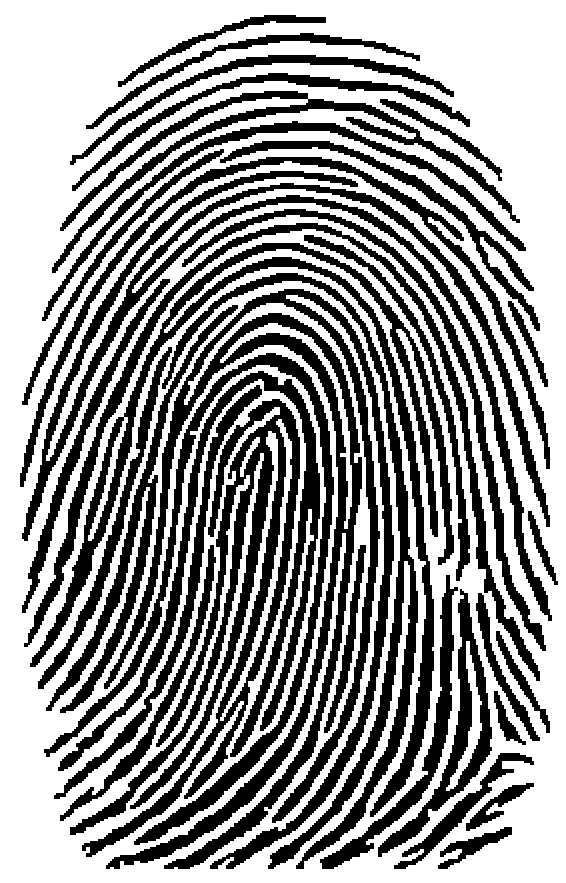
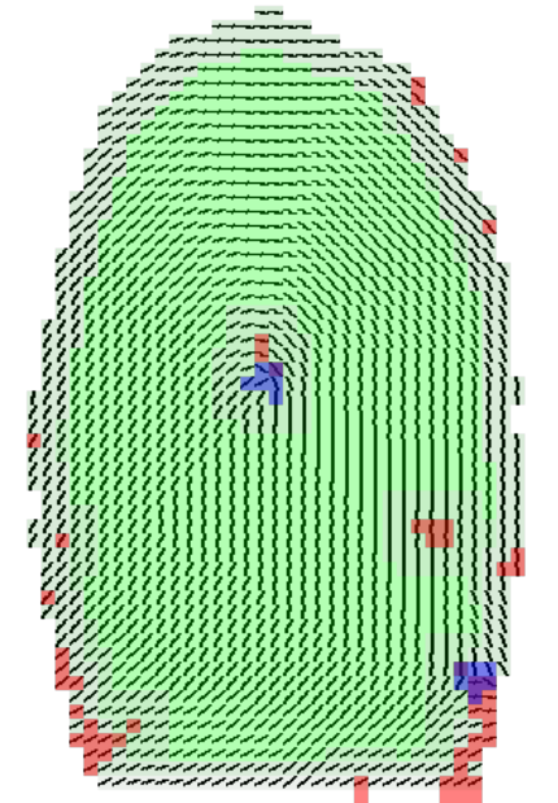

[](https://www.quantifiedcode.com/app/project/3f67bfbdf7b84bc99ea7f4cb3bc000af)

# fpview - View minutia generated by NBIS.

NIST provides a library for fingerprint processing ([NBIS](http://www.nist.gov/itl/iad/ig/nbis.cfm)). 
The `mindtct` in the library outputs several test files with the minutia description. The current package
could be used to visualize the fingerprint data produced by the said application.





## API documentation

```
$> pydoc -w .
```

## Demo

The [data](/fpview/tests/data) folder has a one example extracted using `mindtct`. To run demo:
```
$> ./demo.py
```

## TODO:

- Draw the minutia (origins and directions)
- More README documentation
- More explanation on usage
- List of the classes/methods/vars
- unittests

